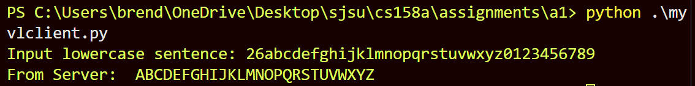
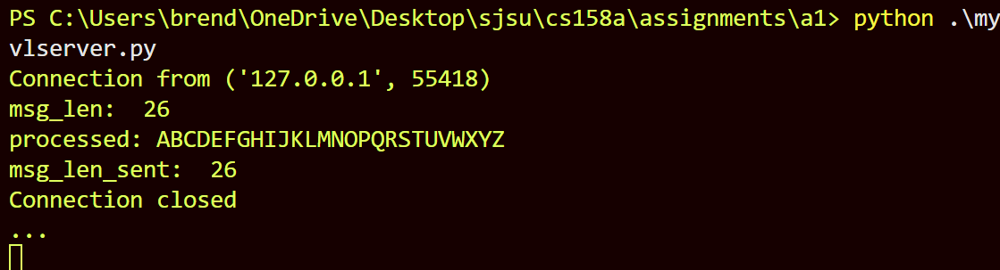

# cs158 Assignment 1

This is a simple TCP client and server using Python sockets.

## How to Run

- Use Python 3
1. Open two terminals. Navigate to directory a1 in both. In one terminal, run:
    ```
    python myvlserver.py
2. In the second, run:
    ```
    python myvlclient.py
3. In the client terminal, input a string where the first two characters are the length of the message, followed by the actual message. 
## Example Runthrough:
### Client side:


### Server side: 
