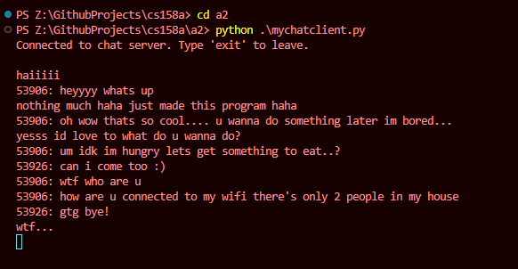

# cs158 Assignment 2

This is a chat server capable of handling multiple clients.

## How to Run

- Use Python 3

1. Open one terminal to start the server:
   ```
   cd a2
   python mychatserver.py
   ```
2. Open another terminal to start the client:

   ```
   cd a2
   python mychatclient.py

   # You may have as many client terminals as you like.
   ```

3. In a client terminal, send any message. Type 'exit' to disconnect from the server.

## Example Runthrough with 3 Clients:

### Server side:


### Client side 1:



### Client side 2:


### Client side 3:


